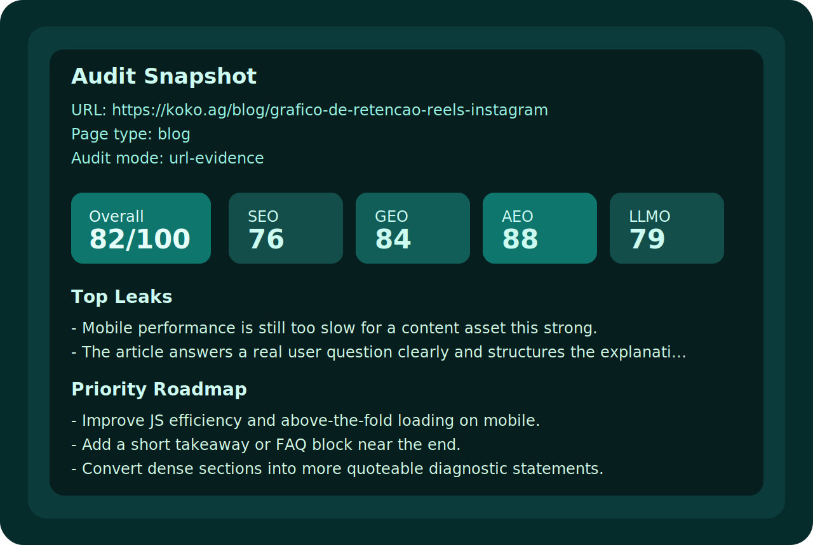
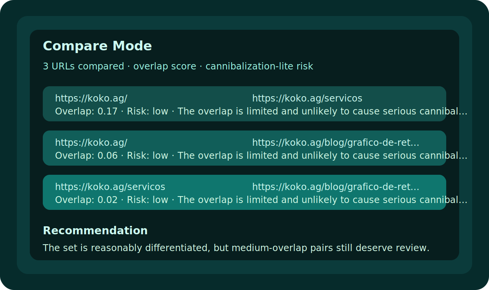

# Koko SEO GEO LLMO AEO

A public Codex skill that audits a landing page, blog post, or draft content and scores it across four dimensions:

- SEO
- GEO
- AEO
- LLMO

The goal is simple: paste a URL or draft, receive a professional scorecard, understand what is strong, what is leaking, and what to fix first.



## What It Does

This skill is designed for non-technical use by default.

It can:

- audit a live URL
- review a draft article before publishing
- review a landing page copy
- compare 2 to 5 URLs for overlap and cannibalization-lite risk
- run a sitewide-lite audit from a homepage or root URL
- generate a compact scorecard
- generate a public scorecard for screenshots or social posts
- generate a carousel-ready summary for Instagram

It does not require Search Console, Google Analytics, or API setup to be useful.

It also includes lightweight AI search readiness checks such as:

- `llms.txt` presence
- quoteable block density
- FAQ-style structure
- list and schema support for retrieval

## Scoring Model

The skill scores pages from `0-100` across:

- `SEO`: crawlability, structure, metadata, internal linking, schema, and performance
- `GEO`: generative engine optimization, including entity clarity and topical completeness
- `AEO`: answer engine optimization, including answer-first formatting and snippet readiness
- `LLMO`: large language model optimization, including chunkability, quoteability, and retrieval clarity

It returns:

- an Audit Snapshot
- a diagnostic breakdown
- a priority roadmap
- an optional Public Scorecard

It can also return:

- page-to-page overlap analysis
- risk labels for cannibalization-lite review
- lightweight sitewide summaries across a small internal page sample
- AI citation readiness signals



## Installation

Clone this repository and link it into your Codex skills directory:

```bash
git clone https://github.com/murilo-koko/koko-seo-geo-llmo-aeo.git
ln -s /absolute/path/to/koko-seo-geo-llmo-aeo ~/.codex/skills/koko-seo-geo-llmo-aeo
```

Restart Codex after linking the skill.

Or use the included installer:

```bash
bash install.sh
```

License: [MIT](./LICENSE)

## Example Prompts

Audit a live URL:

```text
Use $koko-seo-geo-llmo-aeo to audit https://example.com for SEO, GEO, AEO, and LLMO. Return the Audit Snapshot, top leaks, priority roadmap, and Public Scorecard.
```

Review a landing page:

```text
Use $koko-seo-geo-llmo-aeo to score this landing page and tell me what is leaking first.
```

Review a draft:

```text
Use $koko-seo-geo-llmo-aeo to review this draft before publication. Score SEO, GEO, AEO, and LLMO, then give me the top fixes.
```

Compare multiple pages:

```text
Use $koko-seo-geo-llmo-aeo to compare these URLs and tell me whether they overlap too much. I want overlap score, risk label, and what each page should own.
```

Run a sitewide-lite audit:

```text
Use $koko-seo-geo-llmo-aeo to run a sitewide-lite audit from this homepage. Crawl a small set of internal pages and tell me the biggest structural issues first.
```

## Repository Structure

- [SKILL.md](./SKILL.md): the main skill behavior and workflow
- [agents/openai.yaml](./agents/openai.yaml): Codex skill metadata
- [references/](./references/): rubric, demos, prompts, output contract, launch kit
- [scripts/](./scripts/): helper scripts for score computation, shareable output, compare mode, sitewide-lite, and smoke tests
- [assets/](./assets/): skill icons

## Real Smoke Test

If you are working from the repo and want to test the URL-evidence layer directly:

```bash
uv run python scripts/smoke_test_url.py https://koko.ag/blog/grafico-de-retencao-reels-instagram
```

This collects render-audit and Lighthouse evidence and returns JSON.

Compare multiple URLs directly:

```bash
python3 scripts/compare_pages.py https://example.com/page-a https://example.com/page-b
```

Run a sitewide-lite sample crawl:

```bash
python3 scripts/sitewide_lite_audit.py https://example.com --max-pages 5
```

Remove the skill symlink:

```bash
bash uninstall.sh
```

Regenerate the README previews from demo JSON:

```bash
python3 scripts/render_readme_previews.py \
  --audit-json references/demo-koko-blog.json \
  --compare-json references/demo-compare.json \
  --audit-output assets/readme-audit-preview.svg \
  --compare-output assets/readme-compare-preview.svg
```

## Included References

This repo already includes:

- public prompts in PT-BR and English
- demo audits
- score calibration examples
- Instagram launch copy
- AI search readiness guidance

## Status

This is the first public release of the skill and is intentionally optimized for a no-integration workflow.
